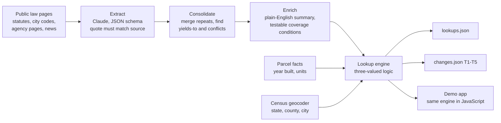

# Stackwise: Rental Housing Law Navigator

**Which rental laws apply at this address, on this date?**
Built for the Hack-Nation x RealPage challenge (Rental Housing Law Navigator). Not legal advice.

- Live demo: https://hack-nation-pioneer-seven.vercel.app/ · backup copy: https://ahmadkonainah.github.io/hack-nation-pioneer/
- Videos (60 seconds each): [demo](submission/Stackwise_Demo_Video.mp4) · [tech](submission/Stackwise_Tech_Video.mp4) · [team](submission/Stackwise_Team_Video.mp4)
- One-page report: `submission/Stackwise_OnePager.pdf`

## What it does

Stackwise reads public rental-housing law and answers, for any address and any date, which rules apply, which have been displaced, which have not started, which are only bills, and what the data cannot say.

1. **Module A, rules.** A language model (Claude Sonnet 5.5, structured outputs) reads each source page and writes one record per rule with a citation, a source link and the exact words it came from. Code checks that every quote is in the page and computes whether the rule is in force, not yet effective, pending or failed from its dates. Records for the same law are merged.
2. **Module B, address lookup.** The U.S. Census geocoder places each address in a state, county and city. The engine tests each rule against year built and unit count. Answers: `applies`, `superseded`, `not_yet_effective`, `pending`, `unknown`. A missing fact gives `unknown`, never a guess. When a stricter local law governs, the state rule is `superseded` and points to the one that governs.
3. **Module C, change tracking.** The same engine runs on any date. Two answers side by side show what changed and for whom. Possible preemption is flagged for a person, not decided.

## Results on the 500 sample addresses (as of 2026-10-01)

| | |
|---|---|
| Rules extracted | **56** from 67 source pages (50 in force, 1 not yet effective, 3 pending bills, 2 failed measures) |
| Addresses placed by the Census geocoder | 493 of 500 (the rest use the city named by their parcel dataset, or are `unknown`) |
| Answers in `lookups.json` | 4,773 (applies 3,411 · superseded 265 · not yet effective 140 · pending 300 · unknown 657) |
| Share of answers that are `unknown` | 14% (mostly missing year built or a special status that parcel data cannot show) |
| Answers carrying a conflict flag | 180 |
| Self-check | 39 checks pass, 0 warning, 0 fail (`python src/selfcheck.py`) |

The organizers' `score.py` and answer key were not shared, so we cannot report an official score. Our own self-check tests the output files against the schema and against the five change tests.

## The five change tests

| Test | What it checks | Our result |
|---|---|---|
| T1 California AB 325 / SB 763 | `not_yet_effective` on 2025-12-31, `applies` on 2026-01-02, every California address | 250 addresses affected |
| T2 Hoboken vs Jersey City bans | each ban only in its own city, neither in Newark | 90 addresses affected, 0 in Newark |
| T3 New Jersey FAIR Act | `not_yet_effective` on 2026-10-01, `applies` on 2027-07-02, every New Jersey address; Jersey City and Hoboken flagged for possible preemption | 140 affected, 90 flagged |
| T4 Massachusetts bills S.2983 and H.5222 | `pending` for every Massachusetts address | 110 addresses |
| T5 Massachusetts ballot question struck | no rent cap for Boston or Cambridge | 0 addresses (correct: the measure is recorded as failed) |

## How it works



**The model reads, the code decides.**
- Every quote must appear word for word in the source page, or the record is rejected.
- Status (in force, not yet effective, pending, failed) is computed by code from dates, not written by the model.
- The lookup engine uses three-valued logic (true, false, unknown). It is deterministic, so the same inputs always give the same answer.
- The browser engine (`web/engine.js`) is a port of `src/engine.py`. `python src/parity_test.py` checks that both give identical answers for every address on 14 dates (7,000 comparisons).

**Unknown beats a guess.** Parcel data has no deed-restriction, subsidy or owner-occupancy status, and often no year built or unit count. Tests that need those facts return `unknown` and say which fact is missing. Exemptions we cannot check are listed as "not checked from parcel data".

**Provenance on every rule.** Citation, source URL, document id, retrieval time, the exact words, and a confidence value.

## Open questions from the brief, and how Stackwise treats them

1. **Berkeley algorithmic-pricing ban, two effective dates in circulation.** The date we extracted is 2026-01. We do not choose between the two dates in circulation; a person should confirm.
2. **New Jersey FAIR Act and the Jersey City and Hoboken bans.** The Act (r-0013, effective 2027-07-01) says towns may not enact conflicting ordinances. Both city bans stay `applies` until then. All three rules carry a conflict flag for human review. We do not decide preemption.
3. **Los Angeles RSO formula, two dates.** We record the date stated on the page we cited (r-0021: 2025-07-01) and do not pick between the two candidates. A person should compare them.
4. **California screening fee for 2026.** The statute sets a cap that is adjusted each year and states no 2026 figure. Rule r-0004 shows "$30 per applicant, CPI-adjusted; itemized receipt required" with its source, a local government page. Treat the figure as secondary.

## Data quality notes

- 27 addresses carry a zip code that does not belong to their state (for example a New Jersey address with a New York zip). We place addresses with the geocoder, not by zip.
- Postal city is not legal city. 33 addresses have a postal city different from the city that governs them (for example Dorchester and Roxbury are Boston). The legal city decides which rules apply.
- Year built is not a certificate-of-occupancy date. When the year equals a cut-off year (for example 1978), the answer is `unknown`.
- Unit counts are missing for most Berkeley, Jersey City, Newark, Hoboken and Boston rows. Where the parcel use text or class code states "five or more units", we use that as a lower bound. One Hoboken row says 2 units but class 4C (apartments); the conflict gives `unknown`.
- 7 addresses could not be matched by the geocoder (no house number, or no match). City rules for them are answered from the parcel dataset's city when it names one, or `unknown`.

## Responsible design

- Every screen and file says this is not legal advice.
- Public sources only. We hand-read pages and did not scrape any site against its terms. Parcel data is public assessor data. No personal data.
- Gaps are shown as gaps: a topic with no rule in our sources says so, and does not imply no law exists.
- Conflicts are flagged for a person. Nothing is silently resolved.
- Plain-English summary first, exact legal words one click away.

## Scalability and cost

Adding a city means adding its source pages to `corpus/` and re-running `python src/run_all.py`. No code changes. Model calls are cached, so a re-run only pays for new or changed pages. The whole corpus (67 pages, 13 jurisdictions) costs a few dollars and takes minutes. Lookups for 500 addresses on one date take about 50 milliseconds in the browser.

## Limitations

- Gaps are shown, not hidden. A city with no rule for a topic means none in our sources, not that none exists. For example, no local rent rule in force was found for Boston, Cambridge, San Diego, and no local just-cause rule for Cambridge, Hoboken, Jersey City; state rules still apply there where they exist. The Rules tab in the app lists every gap. One saved source page (D074 (173 parts)) was a whole website instead of the law text, so the size guard skipped it instead of spending the budget on menus and code. The same San Diego ordinance is covered by the city staff report and two law-firm summaries.
- Source pages are a snapshot from the retrieval date shown on each rule. Law changes; re-run to refresh.
- Some rules come from news articles or law-firm summaries because the code text was not available. They carry lower confidence.
- Coverage tests use parcel data only. A building's real status (rent-controlled, deed-restricted, owner-occupied) needs a human check.

## Run it yourself

Python 3.10+ and an Anthropic API key in a file named `.env` (never commit it; `.gitignore` excludes it).

```
python -m venv .venv
.venv\Scripts\activate          # Windows. On Mac/Linux: source .venv/bin/activate
pip install -r requirements.txt
python src/run_all.py            # extract, consolidate, enrich, resolve, lookup, changes, build_web, selfcheck
python src/lookup.py --as-of 2026-10-01
python src/selfcheck.py
python src/parity_test.py        # needs Node.js; compares Python and JavaScript engines
```

Open `web/index.html` (or `docs/index.html`) in a browser for the demo. It is one self-contained file.

## Repository layout

```
src/        extract.py consolidate.py enrich.py resolve.py engine.py lookup.py changes.py selfcheck.py build_web.py build_site.py run_all.py parity_test.py
web/        app.template.html, engine.js, data.js, index.html (generated)
docs/       index.html (generated copy for GitHub Pages)
outputs/    rules.json lookups.json changes.json (the submission files) plus logs
corpus/     source page text and manifest
data/       sample_addresses.csv
submission/ one-page report, video scripts, post draft
```

## Sources and data

Rules come from the public pages listed in `corpus/corpus_manifest.csv`. Pages the team saved by hand (news, law-firm and code-publisher pages whose terms do not clearly allow copying) are not stored in this repository; their URLs are in the manifest. Each rule links to its source and gives the retrieval date. Data licensing for the parcel datasets is set by their publishers; this repository stores only the 500 sample rows supplied by the organizers.

Not legal advice. Built on a public corpus that no lawyer has reviewed.
